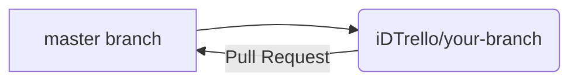

# Partiu!
  
**Week 6** - Aroldo & Patrícia
## Setup

  

Dependencies:
*  [node.js](https://nodejs.org/)
*  [Git](https://git-scm.com/)


Create .env at /partiu-app with the variables: `MONGODB_URI` and `PORT`

```javascript
$ npm install
$ npm run dev   // nodemon
$ npm start     // node
```

```
$ git clone git@github.com:ABettega/partiu-app.git
```
Git flow



```javascript
$ npm install
$ npm run dev   // nodemon
$ npm start     // node
```